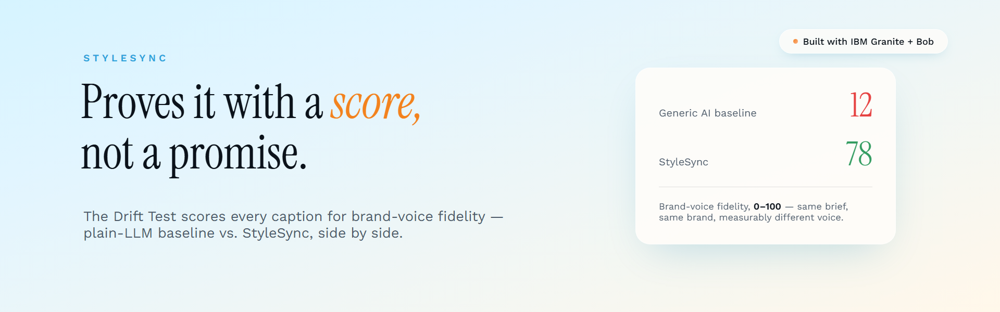

# StyleSync

AI Art Direction and Multi-Agent Creative Platform — built on IBM Granite 3.1 8B.

**AI content for small brands that refuses to sound like every other AI-generated caption — and proves it with a score, not a promise.**

**Who it's for:** solo creators and small-business owners who run their own Instagram — the people making the product by day and posting about it by night.

StyleSync analyzes an Instagram account's posting history and turns it into a living brand voice profile. It then uses that profile for on-brand caption generation, image direction, content scripts, post-mortem diagnosis, and a goal-directed multi-agent campaign system — all running locally, with no cloud API required during inference.

Built for the IBM July Challenge.

---

## Challenge Theme

**Reimagine Creative Industries with AI.**

StyleSync targets the working reality of small creative businesses: the people who run a brand's social presence are usually the same people making the product. A bakery owner is a baker first and a content strategist second. The creative work — deciding what to post, keeping a consistent voice, understanding why something landed — is the part that gets squeezed out.

StyleSync applies AI to that squeeze, without flattening the brand's identity into generic output.

---

## Problem Statement

**Small brands and solo creators are expected to publish constantly, and the AI tools built to help them make the problem worse in a specific way: they all sound the same.**

Every general-purpose AI writing tool is trained on the open internet, so it regresses toward the same voice — the same cadence, the same emoji habits, the same "Indulge in our delicious handcrafted treats ✨". A brand that adopts those tools at volume slowly stops sounding like itself. This is _brand voice drift_, and it's insidious because each individual post looks fine. Only the trend line is damaged.

Four concrete gaps follow from this:

1. **Generation ignores identity.** Tools generate from a prompt, not from who the brand already is. The creator has to describe their own voice from scratch, every time — and self-description is unreliable. What a brand _thinks_ it sounds like and what its top 50 posts actually sound like are different things.
2. **Analytics stop at "what."** Instagram tells a creator a post got 12k reach and 40 saves. It never says _why_, never connects the outcome back to the creative choices, and never proposes a fix.
3. **Privacy is the price of entry.** Every competitive tool routes a brand's full content history through a third-party cloud. For a small business, that means handing over the entire record of what works — to a vendor with an incentive to learn from it.
4. **The workflow is scattered across tools that don't talk to each other.** A caption gets drafted in one app, scheduled in another, its performance read in a third, and its comments answered in a fourth — with no shared understanding of the brand between any of them. The creator is the only integration layer, re-explaining their own voice every time they switch tabs.

---

## Solution Description

**One profile, extracted from your real data, runs your entire week.**

Instead of asking _"what do you want to make?"_, StyleSync asks **"who are you already, and how do you make more of that?"** It ingests the account's own posting history, clusters it into the content pillars that actually exist in the data, and has IBM Granite extract a structured brand voice profile per pillar — tone, recurring vocabulary, signature phrases, structural patterns, and the terms the brand conspicuously _avoids_. That single profile is the source of truth behind every surface below: it recommends today's post, drives full campaign generation, diagnoses why a post flopped, plans strategy, runs autonomous multi-day agents, and drafts DM replies — one extraction, not per-feature setup.

Eight surfaces build on the profile:

| Surface         | What it does                                                                                                                                                                                                             |
| --------------- | -------------------------------------------------------------------------------------------------------------------------------------------------------------------------------------------------------------------- |
| **Today**       | Recommends one post for today, pulled from the account's own best-performing pattern, with a real caption/metrics-driven script pre-filled — one click from a ready-to-film Script Studio draft.                        |
| **Dashboard**   | KPIs, Top Posts with embedded previews, Engagement-by-Pillar and Best-Day-to-Post charts, a background Weekly Brief agent that drafts ideas for the most underused pillar, and Ask-JARVIS quick questions.               |
| **Brand Voice** | The extracted profile itself — tone, signature vocabulary, avoided terms, signature phrases per pillar — plus a Drift Watchdog that flags recent captions drifting off-brand.                                           |
| **Generate**    | Blank Page Solver → 3 creative directions → caption variants + image direction → the Drift Test → Resonance Simulator (3 personas) → Brand Guardian adversarial refine loop → Script Studio (Reel/Carousel/Static/Story, shot-by-shot for Reels, one-click 4-format fan-out). |
| **Diagnose**    | Why Engine diagnoses why a post won or flopped, auto-drafts a Recovery Brief, gated by an honest confidence score.                                                                                                        |
| **Strategy**    | Voice Timeline, Strategic Insights (over/under-invested pillars), Boost Advisor, and the background Weekly Brief agent.                                                                                                   |
| **Agents**      | Goal-directed Autopilot — plans and produces a week of posts autonomously with a live reasoning trace and a convergence quality gate; also a Self-Improving Playbook that learns rules from tagged real outcomes.        |
| **Inbox Triage**| Classifies up to 20 comments/DMs and drafts brand-voice replies for each, correctly skipping spam.                                                                                                                        |

One moment in that stack produces a number instead of a promise: **the Drift Test**, inside Generate. Given the same creative brief, it generates a StyleSync caption alongside a generic-AI baseline and scores both for brand-voice fidelity, highlighting matched signature phrases and flagging off-brand vocabulary. It's credible because it's comparative and reproducible — the same profile, the same prompt, two outputs scored side by side — rather than a claim the product just asserts about itself.

**Workbench** is a save-drawer that sits underneath all eight surfaces rather than being one itself — every caption, script, recovery brief, or agent output can be saved to it from wherever it's created, then starred, reviewed, and outcome-tracked to calibrate future generation.

**Everything runs locally.** Granite executes on-device via Ollama, embeddings via `all-MiniLM-L6-v2`, agent memory in a local ChromaDB. No inference-time cloud call, and no content leaves the machine — the demo works with the network unplugged.

---

## AI Approach and Architecture

### Pipeline

```
Instagram history (Graph API or data export)
   │
   ├─ 1. Clean & structure         src/data/pipeline.py
   │      captions → marketing hooks, engagement metrics normalized
   │
   ├─ 2. Embed & cluster           src/embeddings/cluster.py
   │      all-MiniLM-L6-v2 (local) → L2-normalized → K-Means (k=5)
   │      → the brand's real content pillars, discovered not declared
   │
   ├─ 3. Profile extraction        src/embeddings/profile_extractor.py
   │      Granite per cluster → tone, vocabulary, signature phrases,
   │      avoided terms, structural signature
   │      → a cross-cluster pass renames pillars that aren't distinguishable
   │
   └─ 4. brand_profile.json  ← the single source of truth for every feature
```

### Why this shape

**Clustering before generation.** A brand doesn't have one voice; it has a few. A bakery's behind-the-scenes reels and its custom-cake posts follow different rules. Clustering first means generation is conditioned on the _relevant_ pillar rather than an averaged-out blend that matches nothing.

**Behavior over self-description.** The profile is derived from ~175 real posts. Nothing is asked of the user that their own history can answer.

**Structured extraction, not freeform.** Granite returns strict JSON at every step. Because an 8B model reliably produces small JSON defects, parsing is layered: direct `json.loads` → missing-comma repair → truncation repair → regex field extraction. One malformed character never discards a whole cluster profile.

### Multi-agent layer

Seven specialized agents (`src/agents/`) coordinated by `StyleSyncOrchestrator`, which selects topology by task:

| Task               | Topology                                               |
| ------------------ | ------------------------------------------------------ |
| `single_caption`   | parallel — BrandVoice ∥ Copywriting                    |
| `full_campaign`    | hierarchical — Copy → Critic loop → Visual + Analytics |
| `post_mortem`      | sequential — Analytics → Community                     |
| `trend_briefing`   | parallel — Trend ∥ Analytics                           |
| `community_triage` | flat — Community alone                                 |

The campaign loop is **goal-directed, not count-bounded**: it exits when `critic.approved AND confidence ≥ threshold`, where the creator sets the gate (70/80/90). It also detects plateaus (Δ ≤ 2 across 3 cycles → flag for human review), treats a `factual_gap` as a hard stop, and caps at 8 cycles for safety. The convergence reason is surfaced in the UI rather than hidden.

Three ChromaDB collections persist across runs: semantic (brand voice rules), episodic (past outcomes), procedural (platform rules).

### Design constraints we worked within

An 8B model is not well calibrated at numeric self-scoring, and critique/refine loops don't reliably converge. Rather than hide this, the product is shaped around it: confidence scores are framed as directional ("verify before publishing"), the Brand Guardian is hard-capped at 2 rounds with _best-so-far_ as a legitimate outcome, and quantitative signals (drift scores, engagement, timing) are computed deterministically in Python — Granite is used for judgment and language, not arithmetic.

### Stack

**Backend:** FastAPI · Ollama (IBM Granite 3.1 8B) · LangChain · ChromaDB · sentence-transformers · scikit-learn · SQLite · Instaloader
**Frontend:** Next.js 16 · React 19 · TypeScript · Tailwind CSS · React Query
**Model:** `granite3.1-dense:8b` — 22 coordinated Granite invocations, zero third-party AI dependencies, all local

---

## How IBM Bob Was Used

IBM Bob was the primary development tool for this project, used throughout the build rather than for one isolated task.

**Repository setup and architecture.** Bob was used to scaffold the initial repository structure and establish the separation the project still follows — the FastAPI layer under `api/`, the generation and agent modules under `src/`, and the Next.js frontend under `frontend/`.

**Planning and feature design.** Successive versions of the product were planned with Bob before being built: working through which features to prioritize against a solo-developer timeline, what was feasible on a local 8B model, and how to sequence the phases (core generation → analysis → multi-agent orchestration). Several design decisions documented in this README came out of that planning — notably the choice to cluster before generating, and to hard-cap the Brand Guardian refine loop rather than let it run to convergence.

**Writing and debugging code.** The bulk of Bob's use. It was used to write and iterate on the generation modules, the FastAPI routers, and the React components, and — more heavily — to debug them: tracing why Granite's JSON responses intermittently failed to parse, working through the layered parse-and-repair strategy in `profile_extractor.py` and `image_prompt_generator.py`, and diagnosing frontend issues such as the Tailwind v4 `@layer` cascade behavior that was silently overriding heading colors.

**Documentation.** The reference material under `docs/` — `architecture.md`, `data-catalog.md`, `debugging.md`, `onboarding.md`, and `platform-guide.md` — was drafted with Bob against the actual codebase.

To be precise about the division of labor: **IBM Bob was the development tool used to build StyleSync, and IBM Granite 3.1 8B is the model that runs inside the shipped product.** They serve different roles — Bob wrote and debugged the application; Granite powers all 22 inference calls the application makes at runtime.

---

## What It Does

| Tab             | What you get                                                                                                                                                                                                                       |
| --------------- | ----------------------------------------------------------------------------------------------------------------------------------------------------------------------------------------------------------------------------------- |
| **Today**       | One recommended post for today, pulled from your own best-performing pattern, with a caption and metrics-backed script pre-filled — one click from a ready-to-film Script Studio draft                                            |
| **Dashboard**   | KPIs, Top Posts with embedded previews, Engagement-by-Pillar and Best-Day-to-Post charts, a background Weekly Brief Agent, and Ask-JARVIS quick questions                                                                          |
| **Brand Voice** | Your extracted brand profile — tone, signature vocabulary, avoided terms, signature phrases per pillar — plus a Brand Drift Watchdog that flags captions sliding off-brand                                                         |
| **Generate**    | Blank Page Solver → 3 creative directions → Caption Brief → 3 caption variants + image prompt → the Drift Test → Resonance Simulator (3 persona panel) → Brand Guardian Courtroom (adversarial refine loop) → Script Studio (Reel / Carousel / Static / Story) → Save to Workbench |
| **Diagnose**    | Paste a post + metrics, or expand any real post → Why Engine diagnosis → Recovery Brief, gated by an honest confidence score                                                                                                        |
| **Strategy**    | Voice Timeline chart + Strategic Insights + Boost Advisor + a "This Week" hero recommendation with a Playbook experiment to try next                                                                                               |
| **Agents**      | Autopilot — pick post count, platform, and quality gate, then watch a live reasoning trace plan and produce a week of posts autonomously until it converges; also a Self-Improving Playbook that learns from tagged real outcomes  |
| **Inbox Triage**| Paste up to 20 comments or DMs → Granite classifies (order inquiry / compliment / spam) → drafts brand-voice replies for each, correctly skipping spam                                                                             |

**Workbench** sits underneath all eight tabs rather than being one itself — a persistent SQLite scratchpad where captions, scripts, recovery briefs, and agent outputs from any tab get saved, starred, reviewed, and outcome-tracked to calibrate future generation.

---

## Quick Start

**Prerequisites:** Python 3.11+, Node 18+, [Ollama](https://ollama.com) installed and running.

```bash
# 1. Python environment
python3 -m venv venv && source venv/bin/activate
pip install -r requirements.txt

# 2. Node environment
cd frontend && npm install && cd ..

# 3. Pull the Granite model (one-time, ~5 GB)
ollama pull granite3.1-dense:8b

# 4. Load demo data
cp data/demo_brand_profile.json data/brand_profile.json
cp data/demo_clusters.json data/clusters.json

# 5. Start the stack
uvicorn api.main:app --reload --port 8000 &
cd frontend && npm run dev
```

Open `http://localhost:3000`.

For detailed setup, onboarding your own Instagram account, and verification steps, see [docs/onboarding.md](docs/onboarding.md).

---

## Documentation

| Document                                         | Contents                                                                 |
| ------------------------------------------------ | ------------------------------------------------------------------------ |
| [docs/onboarding.md](docs/onboarding.md)         | Step-by-step setup, prerequisites, running the stack, loading brand data |
| [docs/architecture.md](docs/architecture.md)     | System design, module responsibilities, request flows, caching           |
| [docs/data-catalog.md](docs/data-catalog.md)     | Schemas for every data file, field reference, data flow                  |
| [docs/debugging.md](docs/debugging.md)           | Common issues and fixes: Ollama, pipeline, Instaloader, frontend         |
| [docs/platform-guide.md](docs/platform-guide.md) | End-user guide for all features and content pillars                      |

---

## Stack

**Backend:** FastAPI · Ollama (IBM Granite 3.1 8B) · LangChain · ChromaDB · sentence-transformers · scikit-learn · SQLite · Instaloader  
**Frontend:** Next.js 16 · React 19 · TypeScript · Tailwind CSS · React Query  
**Model:** `granite3.1-dense:8b` — 22 coordinated Granite invocations, zero third-party AI dependencies, all local

---

## API

Interactive docs at `http://localhost:8000/docs` once the backend is running.

Key endpoints:

```
GET  /api/health
GET  /api/onboard/has-profile
POST /api/onboard/start           {handle, brand_name}
GET  /api/onboard/status/{job_id}
POST /api/onboard/reset-demo

GET  /api/brand/profile
GET  /api/brand/clusters

POST /api/create/analyze-moment
POST /api/create/directions
POST /api/create/captions
POST /api/create/image-prompt
POST /api/create/script

POST /api/analyze/why-engine
POST /api/analyze/resonance
POST /api/analyze/guardian
POST /api/analyze/drift

GET  /api/discover/voice-timeline
GET  /api/discover/strategic-insights
GET  /api/discover/boost-advisor

POST /api/weekly-brief/start
GET  /api/weekly-brief/status/{job_id}
GET  /api/weekly-brief/drafts/{batch_id}
GET  /api/weekly-brief/pending-notice

POST /api/repurpose
GET  /api/repurpose/status/{batch_id}

POST /api/triage/batch

POST /api/orchestrate
GET  /api/orchestrate/memory-status

POST   /api/workbench/assets
GET    /api/workbench/assets
PATCH  /api/workbench/assets/{id}
DELETE /api/workbench/assets/{id}

POST /api/agent/chat
GET  /api/agent/session/{id}

POST /api/voice/transcribe
POST /api/voice/synthesize
```
